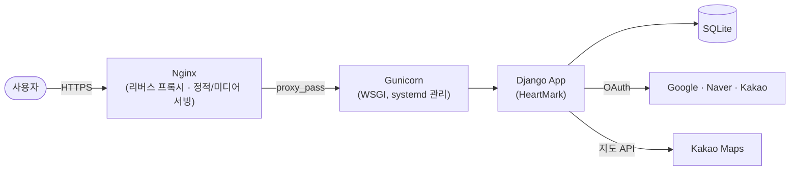

<div align="center">

# 💗 HeartMark

**사진, 감정, 장소를 함께 기록해 나만의 감정 지도를 만드는 위치 기반 기록 서비스**

[](https://www.djangoproject.com/)
[](https://www.python.org/)
[](https://apis.map.kakao.com/)
[](deploy/README.md)

[서비스 바로가기](https://heartmark.duckdns.org/) · [팀원](#팀원) · [문서](#문서)

</div>

<br>

> 
> 배포 주소 : https://heartmark.duckdns.org/
<br>

## ✨ 소개

**마음자국**은 하루하루의 순간을 **사진 · 감정 · 장소** 세 가지 축으로 기록하는 위치 기반 다이어리 서비스입니다.
지도 위에 남긴 기록은 나만의 감정 지도가 되고, 원하는 기록만 골라 친구에게 마음 편지처럼 전할 수 있습니다.

<br>

## 📑 목차

- [🌟 주요 기능](#주요-기능)
- [🛠️ 기술 스택](#기술-스택)
- [🏗️ 아키텍처](#아키텍처)
- [🚀 시작하기](#시작하기)
- [🔐 환경 변수](#환경-변수)
- [📁 프로젝트 구조](#프로젝트-구조)
- [👥 팀원](#팀원)
- [📚 문서](#문서)
- [📎 출처](#출처)

<br>

## 🌟 주요 기능

| 기능 | 설명 | 담당 앱 |
|---|---|---|
| 감정 기록 | 사진과 함께 장소·감정을 기록하고 상세 조회·수정·삭제 | `records` |
| 지도 탐색 | Kakao Maps 기반 장소 검색 및 지도 위 기록 확인 | `locations` |
| 다이어리 · 캘린더 | 월별 캘린더와 목록으로 내 기록 모아보기 | `diary` |
| 배경음악 | 기록마다 분위기에 맞는 BGM 연결 | `bgm` |
| 친구 | 초대 링크로 친구 추가, 요청 수락/거절, 친구 목록 관리 | `friendships` |
| 마음 편지 | 친구에게 기록 공유, 장소 공개 여부 선택, 공유 기록에 댓글 | `record_sharing` |
| 소셜 허브 | 친구 관리, 공유받은 기록, 보낸 기록을 한 곳에서 확인 | `social_hub` |
| 계정 | 이메일 가입/로그인, Google · Naver · Kakao 소셜 로그인, 캐릭터 온보딩, 탈퇴 | `accounts` |
| 마이페이지 | 프로필 확인 및 관리 | `mypage` |

<br>

## 🛠️ 기술 스택

<table>
<tr><td><b>Backend</b></td><td>


</td></tr>
<tr><td><b>Frontend</b></td><td>


</td></tr>
<tr><td><b>Database</b></td><td>


</td></tr>
<tr><td><b>Map / Auth</b></td><td>


</td></tr>
<tr><td><b>Infra</b></td><td>


</td></tr>
</table>

<br>

## 🏗️ 아키텍처



- EC2(Ubuntu)에서 `heartmark.service`(systemd)가 Gunicorn 프로세스를 상시 구동합니다.
- Nginx가 앞단에서 요청을 받아 정적/미디어 파일은 직접 서빙하고, 나머지는 Gunicorn으로 프록시합니다.
- 배포 설정 템플릿: [`deploy/README.md`](deploy/README.md) · [`deploy/heartmark.service`](deploy/heartmark.service) · [`deploy/nginx-heartmark.conf`](deploy/nginx-heartmark.conf)

<details>
<summary>운영 서버 배포 절차 보기</summary>

```bash
source venv/bin/activate
python manage.py migrate
python manage.py collectstatic --noinput
python manage.py check --deploy
sudo systemctl restart heartmark
```

</details>

<br>

## 🚀 시작하기

### 요구 사항

- Python 3.11+
- pip, venv

### 설치 및 실행

```bash
# 1. 가상환경 생성 및 활성화
python -m venv .venv
.venv\Scripts\activate          # Windows
# source .venv/bin/activate     # macOS / Linux

# 2. 의존성 설치
pip install -r requirements.txt

# 3. 환경 변수 설정
copy .env.example .env          # Windows
# cp .env.example .env          # macOS / Linux
# .env 파일을 열어 값 채우기

# 4. 마이그레이션 및 서버 실행
python manage.py migrate
python manage.py runserver
```

서버 실행 후 `http://127.0.0.1:8000/`으로 접속합니다.

<br>

## 🔐 환경 변수

`.env.example`을 복사해 `.env`를 만들고 아래 값을 채웁니다.

| 변수 | 설명 |
|---|---|
| `SITE_DOMAIN` | 서비스 도메인 (로컬은 `127.0.0.1:8000`) |
| `SITE_NAME` | 사이트 표시 이름 |
| `DJANGO_DEBUG` | 디버그 모드 (운영 환경에서는 반드시 `False`) |
| `DJANGO_SECRET_KEY` | Django 시크릿 키 |
| `DJANGO_ALLOWED_HOSTS` | 허용 호스트 목록 (콤마 구분) |
| `DJANGO_CSRF_TRUSTED_ORIGINS` | CSRF 신뢰 오리진 (운영 도메인 등록) |
| `DJANGO_SECURE_COOKIES` | HTTPS 환경 여부에 따른 쿠키 보안 설정 |
| `GOOGLE_CLIENT_ID` / `GOOGLE_CLIENT_SECRET` | Google 소셜 로그인 키 |
| `NAVER_CLIENT_ID` / `NAVER_CLIENT_SECRET` | Naver 소셜 로그인 키 |
| `KAKAO_CLIENT_ID` / `KAKAO_CLIENT_SECRET` | Kakao 소셜 로그인 키 |
| `KAKAO_REST_KEY` | Kakao REST API 키 (서버용) |
| `KAKAO_JS_KEY` | Kakao Maps JavaScript 키 (클라이언트용) |

<br>

## 📁 프로젝트 구조

```text
HeartMark/
├── config/            # Django 프로젝트 설정
├── common/            # 공통 기능
├── accounts/          # 회원 · 인증 · 소셜 로그인 · 캐릭터 · 온보딩
├── mypage/            # 마이페이지
├── locations/         # 지도 및 장소 탐색
├── records/           # 기록 작성 · 상세 · 수정 · 삭제
├── diary/             # 다이어리 목록 및 캘린더 조회
├── bgm/               # 기록별 배경음악
├── friendships/       # 친구 초대 · 요청 · 목록
├── record_sharing/    # 기록 공유(마음 편지) · 댓글
├── social_hub/        # 친구 / 공유 기록 통합 화면
├── deploy/            # EC2 배포 템플릿 (systemd, nginx)
├── docs/              # 팀 협업 문서
├── templates/         # 공통 레이아웃
├── manage.py
└── requirements.txt
```

각 앱의 정적 파일은 `<app>/static/<app>/css/`, `<app>/static/<app>/js/`에 둡니다.

<br>

## 👥 팀원

<div align="center">

<table>
<tr>
<th align="center">서영은</th>
<th align="center">신은아</th>
<th align="center">한지수</th>
<th align="center">홍연우</th>
</tr>
<tr>
<td align="center"><a href="https://github.com/dahliare"></a></td>
<td align="center"><a href="https://github.com/seunnna7"></a></td>
<td align="center"><a href="https://github.com/1wltn"></a></td>
<td align="center"><a href="https://github.com/wepe37"></a></td>
</tr>
<tr>
<td align="center"><a href="https://github.com/dahliare">@dahliare</a></td>
<td align="center"><a href="https://github.com/seunnna7">@seunnna7</a></td>
<td align="center"><a href="https://github.com/1wltn">@1wltn</a></td>
<td align="center"><a href="https://github.com/wepe37">@wepe37</a></td>
</tr>
<tr>
<td align="center">PM · FE · BE</td>
<td align="center">FE · BE</td>
<td align="center">FE · BE</td>
<td align="center">FE · BE</td>
</tr>
</table>

</div>


<br>

## 📚 문서

| 문서 | 내용 |
|---|---|
| [`docs/INTEGRATION.md`](docs/INTEGRATION.md) | 개발 협업 규칙 |
| [`friendships/README.md`](friendships/README.md) | 친구 기능 백엔드 가이드 |
| [`deploy/README.md`](deploy/README.md) | 배포 가이드 |

<br>

## 📎 출처

- 서울 자치구 지도: Kurykh, Wikimedia Commons, CC BY-SA 3.0 — 수정하여 사용함

<br>

<div align="center">

Made by **Team HeartMark**

</div>
